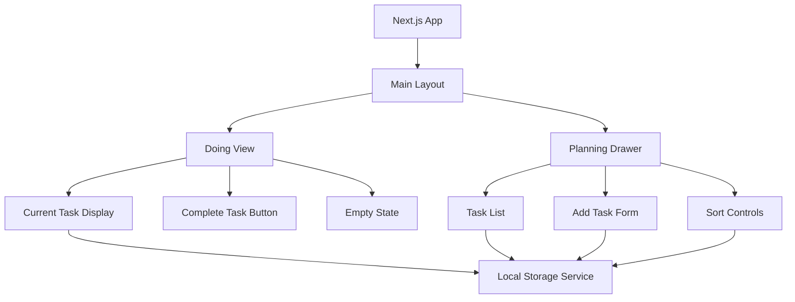

# Design Document

## Overview

The Focus Todo App is a minimalist Next.js single-page application designed to enhance productivity through focused task management. The application features a dual-view architecture: a primary "doing" view for concentrated work and a secondary "planning" view accessible via a left-side drawer. The app emphasizes the present moment by showing only the current task while keeping planning activities easily accessible but non-intrusive.

The MVP implementation uses local storage for data persistence, with a clean architecture that will facilitate future migration to Convex for backend functionality.

## Architecture

### High-Level Architecture



### Technology Stack

- **Framework**: Next.js 14+ with App Router
- **UI Components**: shadcn/ui for consistent, accessible components
- **Styling**: Tailwind CSS for responsive design and animations
- **State Management**: React Context + useReducer for global state
- **Data Persistence**: Local Storage with JSON serialization
- **Drag & Drop**: @dnd-kit/core for reordering functionality
- **Icons**: Lucide React for consistent iconography

### Folder Structure

```
src/
├── app/
│   ├── layout.tsx
│   ├── page.tsx
│   └── globals.css
├── components/
│   ├── ui/          # shadcn/ui components
│   │   ├── button.tsx
│   │   ├── input.tsx
│   │   ├── select.tsx
│   │   ├── badge.tsx
│   │   ├── drawer.tsx
│   │   └── card.tsx
│   ├── DoingView.tsx
│   ├── PlanningDrawer.tsx
│   ├── TaskCard.tsx
│   ├── TaskForm.tsx
│   └── EmptyState.tsx
├── hooks/
│   ├── useLocalStorage.ts
│   ├── useTodos.ts
│   └── useKeyboard.ts
├── lib/
│   ├── types.ts
│   ├── utils.ts
│   └── constants.ts
└── context/
    └── TodoContext.tsx
```

## Components and Interfaces

### Core Data Types

```typescript
interface Todo {
  id: string;
  title: string;
  description: string;
  priority: 'high' | 'medium' | 'low';
  tags: string[];
  color: string;
  createdDate: Date;
  status: 'pending' | 'in-progress' | 'completed';
  order: number;
}

interface TodoState {
  todos: Todo[];
  currentTodoId: string | null;
  isDrawerOpen: boolean;
}

type TodoAction = 
  | { type: 'ADD_TODO'; payload: Omit<Todo, 'id' | 'createdDate' | 'order'> }
  | { type: 'UPDATE_TODO'; payload: { id: string; updates: Partial<Todo> } }
  | { type: 'DELETE_TODO'; payload: string }
  | { type: 'COMPLETE_TODO'; payload: string }
  | { type: 'REORDER_TODOS'; payload: Todo[] }
  | { type: 'SORT_BY_PRIORITY' }
  | { type: 'TOGGLE_DRAWER' }
  | { type: 'SET_CURRENT_TODO'; payload: string | null };
```

### Component Architecture

#### Main Layout Component
- Manages global state and drawer visibility
- Handles keyboard shortcuts (Escape to close drawer)
- Provides responsive container for both views

#### DoingView Component
- Displays current task or empty state
- Shows task details (title, description, priority badge, tags, color indicator)
- Provides completion button with confirmation
- Automatically advances to next task after completion

#### PlanningDrawer Component
- Slide-in drawer from left side with backdrop
- Contains task list, add form, and sort controls
- Implements smooth animations using CSS transforms
- Closes on backdrop click or Escape key

#### TaskCard Component
- Reusable component for displaying task information
- Supports drag handle for reordering
- Shows all task properties with appropriate styling
- Includes edit and delete actions

#### TaskForm Component
- Form for adding/editing tasks
- Validates required fields (title)
- Supports tag input with autocomplete
- Color picker for task categorization

### State Management

The application uses React Context with useReducer for predictable state management:

```typescript
const TodoContext = createContext<{
  state: TodoState;
  dispatch: Dispatch<TodoAction>;
} | null>(null);
```

Key state management principles:
- All state changes go through the reducer for consistency
- Local storage sync happens in useEffect hooks
- Current task is determined by the first non-completed task in order
- Drawer state is managed separately from todo data

## Data Models

### Todo Model

The Todo interface represents the core data structure with the following properties:

- **id**: UUID generated using crypto.randomUUID()
- **title**: Required string, max 100 characters
- **description**: Optional string, max 500 characters  
- **priority**: Enum with values 'high', 'medium', 'low'
- **tags**: Array of strings for categorization
- **color**: Hex color code for visual identification
- **createdDate**: ISO string timestamp
- **status**: Enum tracking task progression
- **order**: Number for custom sorting (lower = higher priority)

### Local Storage Schema

Data is stored in localStorage under the key 'focus-todo-app' as a JSON object:

```json
{
  "todos": [
    {
      "id": "uuid-string",
      "title": "Task title",
      "description": "Task description",
      "priority": "high",
      "tags": ["work", "urgent"],
      "color": "#ff6b6b",
      "createdDate": "2024-01-01T00:00:00.000Z",
      "status": "pending",
      "order": 1
    }
  ],
  "settings": {
    "lastOpenedDrawer": false
  }
}
```

### Data Validation

All data operations include validation:
- Title is required and non-empty
- Priority must be valid enum value
- Color must be valid hex code
- Tags are sanitized (trimmed, lowercase)
- Dates are validated ISO strings

## Error Handling

### Local Storage Error Handling

```typescript
class StorageService {
  private handleStorageError(error: Error, operation: string) {
    console.error(`Storage ${operation} failed:`, error);
    
    if (error.name === 'QuotaExceededError') {
      // Handle storage quota exceeded
      this.showStorageQuotaWarning();
    } else if (error.name === 'SecurityError') {
      // Handle private browsing mode
      this.showPrivateBrowsingWarning();
    }
    
    // Fallback to in-memory storage
    this.fallbackToMemoryStorage();
  }
}
```

### Error Boundaries

- React Error Boundary wraps the main application
- Graceful degradation when localStorage is unavailable
- User-friendly error messages for common scenarios
- Automatic retry mechanisms for transient failures

### Validation Errors

- Form validation with real-time feedback
- Clear error messages for invalid inputs
- Prevention of duplicate task creation
- Graceful handling of malformed stored data

## Testing Strategy

### Unit Testing

**Components Testing (Jest + React Testing Library)**
- DoingView: Current task display, completion flow, empty states
- PlanningDrawer: Open/close behavior, task list rendering
- TaskForm: Form validation, submission, error handling
- TaskCard: Display formatting, interaction handlers

**Hooks Testing**
- useLocalStorage: Storage operations, error handling, serialization
- useTodos: State management, CRUD operations, sorting logic
- useKeyboard: Keyboard shortcuts, event handling

**Utilities Testing**
- Data validation functions
- Date formatting utilities
- Color manipulation helpers
- Sorting algorithms

### Integration Testing

**User Workflows**
- Complete task flow: View task → Mark complete → Next task appears
- Add task flow: Open drawer → Fill form → Save → Close drawer
- Reorder tasks: Drag and drop → Verify new order → Persist changes
- Priority sorting: Click sort button → Verify order → Persist changes

**Local Storage Integration**
- Data persistence across page reloads
- Error handling when storage is full
- Recovery from corrupted data
- Migration between data schema versions

### End-to-End Testing (Playwright)

**Critical User Journeys**
1. First-time user: Empty state → Add first task → Complete task
2. Returning user: Load existing tasks → Manage tasks → Complete workflow
3. Mobile user: Touch interactions → Drawer behavior → Responsive layout
4. Keyboard user: Navigation shortcuts → Accessibility compliance

**Cross-Browser Testing**
- Chrome, Firefox, Safari compatibility
- Mobile browser testing (iOS Safari, Chrome Mobile)
- Local storage behavior across browsers
- Performance testing on slower devices

### Performance Testing

**Metrics to Monitor**
- Initial page load time (< 2 seconds)
- Drawer animation smoothness (60fps)
- Large task list rendering performance (100+ tasks)
- Local storage read/write performance
- Memory usage with extended use

**Optimization Strategies**
- Virtual scrolling for large task lists
- Debounced auto-save for form inputs
- Lazy loading of non-critical components
- Efficient re-rendering with React.memo and useMemo